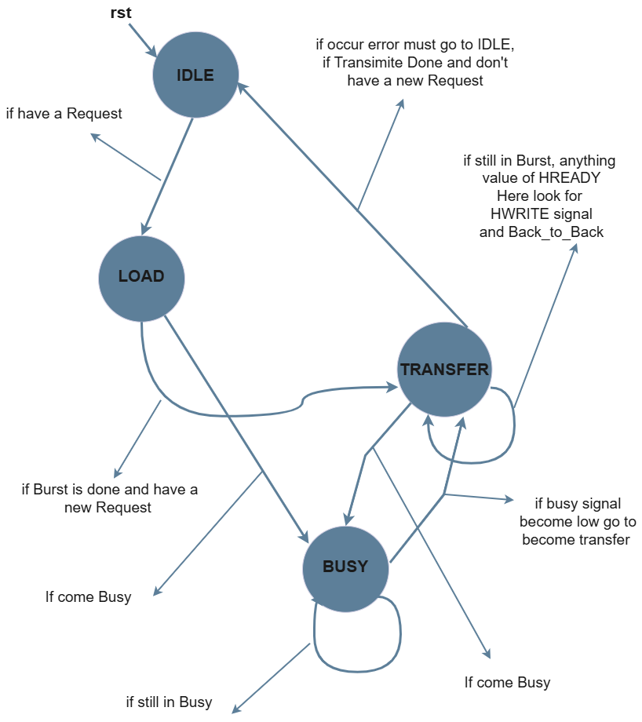
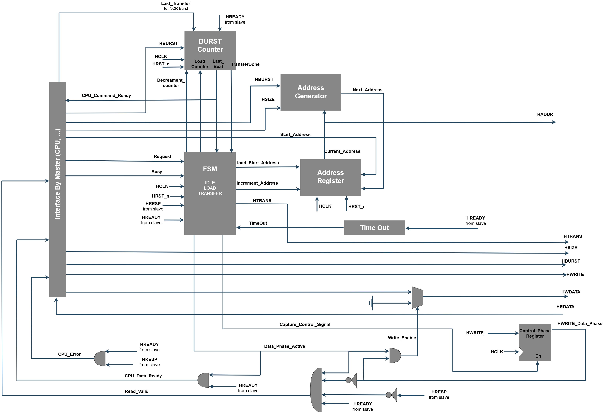

## 🧠 FSM Controller

The **Finite State Machine (FSM)** is the main control unit of the AHB-Lite Master. It manages the complete transfer sequence by controlling transaction initialization, burst execution, address updates, and transfer completion while ensuring compliance with the AHB-Lite protocol.

### ✨ Features

- 🚀 Initiates new AHB-Lite transactions.
- 📥 Loads the burst counter and starting address.
- 🔄 Generates `HTRANS` values (`NONSEQ` and `SEQ`).
- 📍 Controls address progression during burst transfers.
- 🔢 Coordinates burst counter decrement.
- ⏳ Waits for `HREADY` before advancing to the next beat.
- 🔁 Supports back-to-back transactions.
- 📦 Supports `SINGLE`, `INCR`, `INCR4`, `INCR8`, `INCR16`, `WRAP4`, `WRAP8`, and `WRAP16` bursts.
- ⚠️ Handles timeout and slave error responses.
- ✅ Returns to the **IDLE** state after transfer completion.

### 🏗️ FSM Controller Architecture

  

### 📊 AHB-Lite Master FSM State Diagram

  

